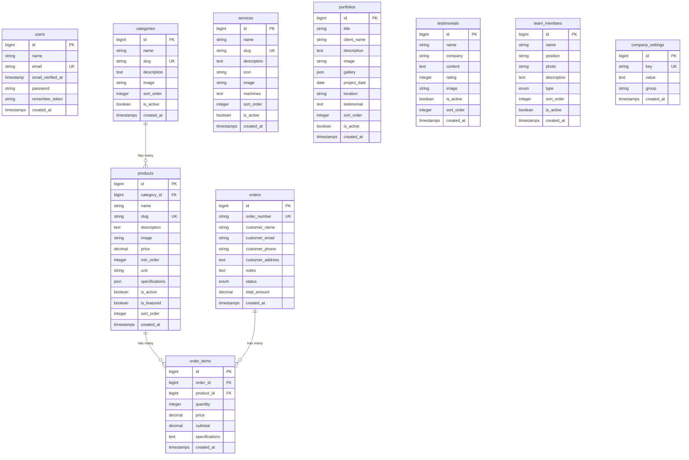
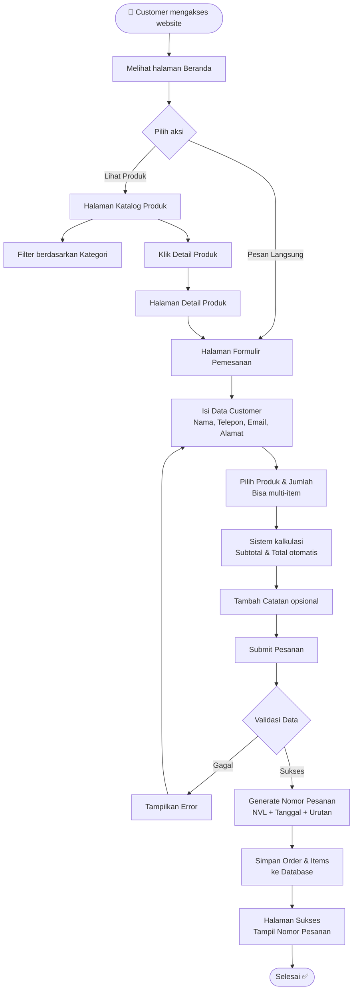
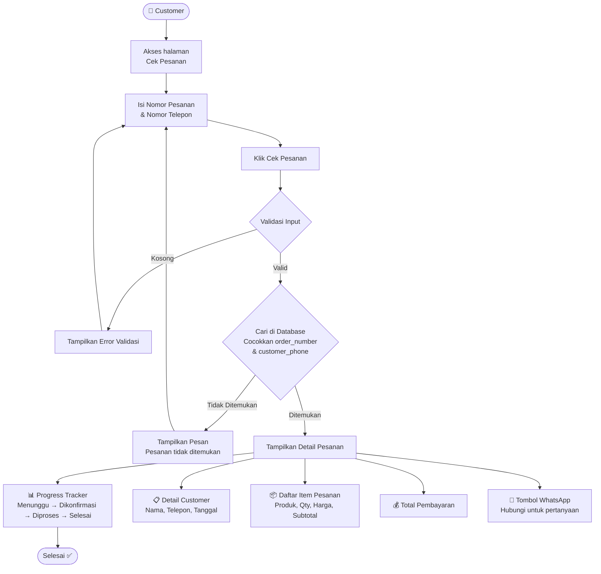
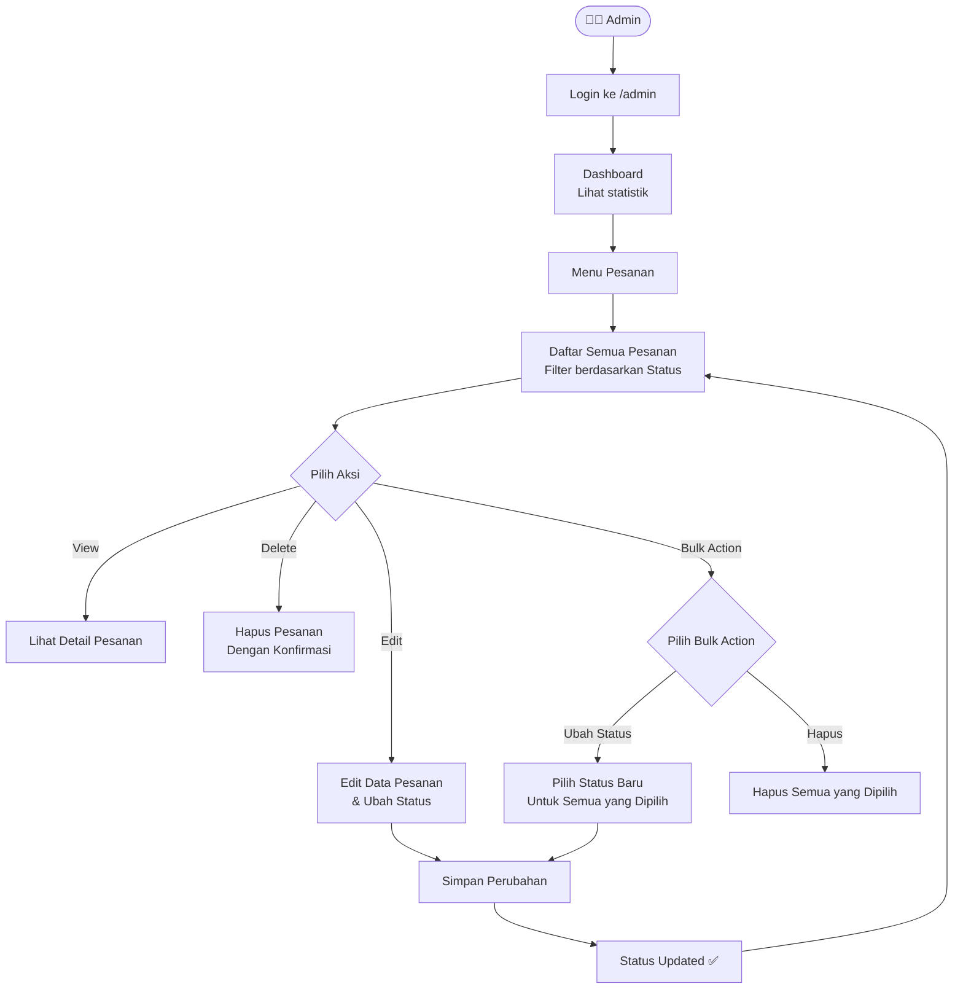
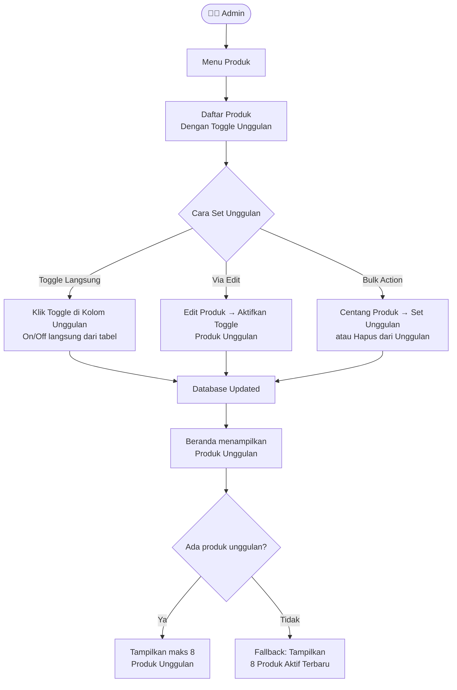

# 🖨️ Novalindo Digital Printing & Offset

> **"Solusi, Inovasi, Kreasi"**

Website company profile dan sistem pemesanan online untuk **CV Novalindo** — perusahaan percetakan yang bergerak di bidang Digital Printing & Cetak Offset.

---

## 📋 Daftar Isi

- [Tentang Website](#-tentang-website)
- [Fitur Utama](#-fitur-utama)
- [Tech Stack](#-tech-stack)
- [Struktur Data (ERD)](#-struktur-data-erd)
- [Alur Database & Relasi](#-alur-database--relasi)
- [Use Case Diagram](#-use-case-diagram)
- [Flowchart Sistem](#-flowchart-sistem)
- [Struktur Halaman](#-struktur-halaman)
- [Instalasi & Setup](#-instalasi--setup)
- [Akun Default](#-akun-default)

---

## 📖 Tentang Website

Website **Novalindo** adalah platform digital yang menggabungkan **company profile** dengan **sistem pemesanan online**. Website ini dibangun untuk memudahkan pelanggan melihat produk & layanan percetakan, melakukan pemesanan, serta melacak status pesanan secara mandiri tanpa perlu login.

### Tujuan Website:
1. Menampilkan profil perusahaan, layanan, dan portofolio secara profesional
2. Menyediakan katalog produk percetakan yang lengkap dengan kategori
3. Memfasilitasi pemesanan online dengan formulir yang mudah digunakan
4. Memberikan fitur cek status pesanan secara real-time
5. Menyediakan panel admin untuk mengelola seluruh konten dan pesanan

---

## ✨ Fitur Utama

### Pengunjung (Customer)
| Fitur | Deskripsi |
|-------|-----------|
| 🏠 Beranda | Landing page dengan hero, layanan, kategori produk, produk unggulan, testimoni |
| ℹ️ Tentang Kami | Profil perusahaan, visi & misi, tim/karyawan |
| 🔧 Layanan | Daftar layanan percetakan (Digital Print, Offset, Outdoor, dll) |
| 📦 Katalog Produk | Produk dengan filter kategori, detail produk, produk terkait |
| 🎨 Portofolio | Galeri hasil karya dan proyek yang telah dikerjakan |
| 📞 Kontak | Informasi kontak perusahaan, alamat, WhatsApp |
| 🛒 Pemesanan Online | Formulir pemesanan multi-item dengan kalkulasi otomatis |
| 🔍 Cek Pesanan | Lacak status pesanan dengan nomor pesanan + nomor telepon |

### Admin (Filament Panel)
| Fitur | Deskripsi |
|-------|-----------|
| 📊 Dashboard | Statistik ringkasan (total pesanan, pendapatan, produk, dll) |
| 📁 Kategori | CRUD kategori produk |
| 📦 Produk | CRUD produk, toggle aktif/unggulan langsung dari tabel |
| 🔧 Layanan | CRUD layanan percetakan |
| 🎨 Portofolio | CRUD portofolio/proyek |
| 💬 Testimoni | CRUD testimoni pelanggan |
| 👥 Tim | CRUD anggota tim (karyawan & reseller) |
| 📋 Pesanan | Kelola pesanan, ubah status, bulk action, hapus |
| ⚙️ Pengaturan | Key-value settings perusahaan (kontak, sosmed, visi misi, dll) |

---

## 🛠 Tech Stack

| Layer | Teknologi | Versi |
|-------|-----------|-------|
| Backend | Laravel | 12.x |
| PHP | PHP | ≥ 8.2 |
| Admin Panel | Filament | 5.2 |
| Frontend CSS | Tailwind CSS | 4.x |
| Frontend JS | Alpine.js | 3.x |
| Bundler | Vite | 7.x |
| Database | SQLite | — |

---

## 🗄 Struktur Data (ERD)



---

## 🔗 Alur Database & Relasi

### Relasi Antar Tabel

```
┌──────────────┐       ┌──────────────┐       ┌──────────────┐
│  categories  │──1:N──│   products   │──1:N──│  order_items │
│              │       │              │       │              │
│ • id (PK)    │       │ • id (PK)    │       │ • id (PK)    │
│ • name       │       │ • category_id│       │ • order_id   │
│ • slug       │       │ • name       │       │ • product_id │
│ • is_active  │       │ • price      │       │ • quantity   │
└──────────────┘       │ • is_featured│       │ • price      │
                       │ • is_active  │       │ • subtotal   │
                       └──────────────┘       └──────┬───────┘
                                                     │ N:1
                                              ┌──────┴───────┐
                                              │    orders    │
                                              │              │
                                              │ • id (PK)    │
                                              │ • order_number│
                                              │ • customer_* │
                                              │ • status     │
                                              │ • total_amount│
                                              └──────────────┘

┌──────────────┐  ┌──────────────┐  ┌──────────────┐  ┌──────────────────┐
│   services   │  │  portfolios  │  │ testimonials  │  │ company_settings │
│ (standalone) │  │ (standalone) │  │ (standalone)  │  │  (key-value)     │
└──────────────┘  └──────────────┘  └──────────────┘  └──────────────────┘

┌──────────────┐  ┌──────────────┐
│ team_members │  │    users     │
│ (standalone) │  │ (admin auth) │
└──────────────┘  └──────────────┘
```

### Penjelasan Relasi:
- **Category → Product** (One-to-Many): Satu kategori memiliki banyak produk. Jika kategori dihapus, semua produk di dalamnya ikut terhapus (cascade).
- **Order → OrderItem** (One-to-Many): Satu pesanan memiliki banyak item produk. Jika pesanan dihapus, semua item ikut terhapus (cascade).
- **Product → OrderItem** (One-to-Many): Satu produk dapat dipesan berkali-kali di berbagai pesanan.
- **Tabel Standalone**: `services`, `portfolios`, `testimonials`, `team_members`, `company_settings` tidak memiliki relasi ke tabel lain.

### Status Pesanan (Order Status Flow):
```
pending → confirmed → processing → completed
    │                              ↗
    └──────────── cancelled ──────┘
```
| Status | Label Indonesia | Warna |
|--------|----------------|-------|
| `pending` | Menunggu Konfirmasi | 🟡 Kuning |
| `confirmed` | Dikonfirmasi | 🔵 Biru |
| `processing` | Diproses | 🟣 Ungu |
| `completed` | Selesai | 🟢 Hijau |
| `cancelled` | Dibatalkan | 🔴 Merah |

### Format Nomor Pesanan:
```
NVL + YYYYMMDD + 0001
Contoh: NVL202602080001 (pesanan pertama tanggal 8 Feb 2026)
```

---

## 👤 Use Case Diagram

```mermaid
graph TB
    subgraph Aktor
        Customer["🧑 Pengunjung / Customer"]
        Admin["👨‍💼 Admin"]
    end

    subgraph "Website Publik"
        UC1["Melihat Beranda"]
        UC2["Melihat Tentang Kami"]
        UC3["Melihat Layanan"]
        UC4["Melihat Katalog Produk"]
        UC5["Melihat Detail Produk"]
        UC6["Filter Produk per Kategori"]
        UC7["Melihat Portofolio"]
        UC8["Melihat Kontak"]
        UC9["Membuat Pesanan Online"]
        UC10["Cek Status Pesanan"]
        UC11["Menghubungi via WhatsApp"]
    end

    subgraph "Admin Panel /admin"
        UC12["Login Admin"]
        UC13["Melihat Dashboard & Statistik"]
        UC14["Kelola Kategori Produk"]
        UC15["Kelola Produk & Produk Unggulan"]
        UC16["Kelola Layanan"]
        UC17["Kelola Portofolio"]
        UC18["Kelola Testimoni"]
        UC19["Kelola Tim / Karyawan"]
        UC20["Kelola Pesanan & Ubah Status"]
        UC21["Kelola Pengaturan Perusahaan"]
    end

    Customer --> UC1
    Customer --> UC2
    Customer --> UC3
    Customer --> UC4
    Customer --> UC5
    Customer --> UC6
    Customer --> UC7
    Customer --> UC8
    Customer --> UC9
    Customer --> UC10
    Customer --> UC11

    Admin --> UC12
    Admin --> UC13
    Admin --> UC14
    Admin --> UC15
    Admin --> UC16
    Admin --> UC17
    Admin --> UC18
    Admin --> UC19
    Admin --> UC20
    Admin --> UC21
```



---

## 🔄 Flowchart Sistem

### 1. Flowchart Pemesanan Online



### 2. Flowchart Cek Status Pesanan



### 3. Flowchart Admin Kelola Pesanan



### 4. Flowchart Admin Kelola Produk Unggulan



---

## 📄 Struktur Halaman

### Routes & URL

| Method | URL | Halaman | Deskripsi |
|--------|-----|---------|-----------|
| GET | `/` | Beranda | Landing page utama |
| GET | `/tentang` | Tentang Kami | Profil, visi misi, tim |
| GET | `/layanan` | Layanan | Daftar layanan percetakan |
| GET | `/produk` | Katalog Produk | Semua produk + filter kategori |
| GET | `/produk/kategori/{slug}` | Produk per Kategori | Produk dalam kategori tertentu |
| GET | `/produk/{slug}` | Detail Produk | Informasi lengkap produk |
| GET | `/portofolio` | Portofolio | Galeri hasil karya |
| GET | `/kontak` | Kontak | Info kontak & WhatsApp |
| GET | `/pesan` | Form Pemesanan | Formulir pesan produk |
| POST | `/pesan` | Submit Pesanan | Proses simpan pesanan |
| GET | `/pesan/sukses/{no}` | Sukses | Konfirmasi pesanan berhasil |
| GET | `/cek-pesanan` | Cek Pesanan | Form input nomor pesanan |
| POST | `/cek-pesanan` | Hasil Cek | Tampilkan status & detail |
| GET | `/admin` | Admin Panel | Dashboard admin (Filament) |

### Struktur View Files

```
resources/views/
├── layouts/
│   └── app.blade.php               # Layout utama (navbar + footer + WhatsApp button)
├── components/
│   ├── navbar.blade.php             # Navigasi responsif (transparent → floating)
│   └── footer.blade.php             # Footer website
├── home.blade.php                   # Beranda (hero, layanan, kategori, produk unggulan, testimoni, CTA)
├── about.blade.php                  # Tentang Kami (profil, visi misi, tim)
├── services.blade.php               # Daftar Layanan
├── portfolio.blade.php              # Galeri Portofolio
├── contact.blade.php                # Halaman Kontak
├── products/
│   ├── index.blade.php              # Katalog Produk + sidebar kategori
│   └── show.blade.php               # Detail Produk + produk terkait
└── order/
    ├── create.blade.php             # Formulir Pemesanan
    ├── success.blade.php            # Konfirmasi Pesanan Berhasil
    └── track.blade.php              # Cek Status Pesanan + progress tracker
```

---

## ⚙️ Instalasi & Setup

### Prasyarat
- PHP ≥ 8.2
- Composer
- Node.js & NPM

### Langkah Instalasi

```bash
# 1. Clone repository
git clone <repository-url>
cd Novalindo

# 2. Install dependencies
composer install
npm install

# 3. Setup environment
cp .env.example .env
php artisan key:generate

# 4. Buat database (SQLite)
touch database/database.sqlite

# 5. Jalankan migrasi & seeder
php artisan migrate --seed

# 6. Publish Filament assets
php artisan filament:assets

# 7. Build frontend
npm run build

# 8. Buat symlink storage
php artisan storage:link

# 9. Jalankan server
php artisan serve
```

Atau gunakan shortcut:
```bash
composer setup    # Install semua sekaligus
composer dev      # Jalankan development server
```

---

## 🔑 Akun Default

| Role | Email | Password |
|------|-------|----------|
| Admin | `admin@novalindo.com` | `password` |

Akses admin panel: [http://localhost:8000/admin](http://localhost:8000/admin)

---

## 📁 Struktur Project

```
Novalindo/
├── app/
│   ├── Filament/
│   │   ├── Resources/              # 8 Filament Resources (CRUD admin)
│   │   └── Widgets/                # StatsOverview widget
│   ├── Http/Controllers/
│   │   ├── HomeController.php      # Halaman statis & beranda
│   │   ├── OrderController.php     # Pemesanan & tracking
│   │   └── ProductController.php   # Katalog produk
│   ├── Models/                     # 10 Eloquent Models
│   └── Providers/
├── database/
│   ├── migrations/                 # 13 migration files
│   └── seeders/
│       └── DatabaseSeeder.php      # Data awal lengkap
├── resources/views/                # Blade templates
├── routes/
│   └── web.php                     # 13 routes publik
└── public/
    └── images/
        └── Logo.png                # Logo perusahaan
```

---

<p align="center">
  Dibuat dengan ❤️ menggunakan <strong>Laravel 12</strong> + <strong>Filament 5</strong> + <strong>Tailwind CSS 4</strong>
</p>
